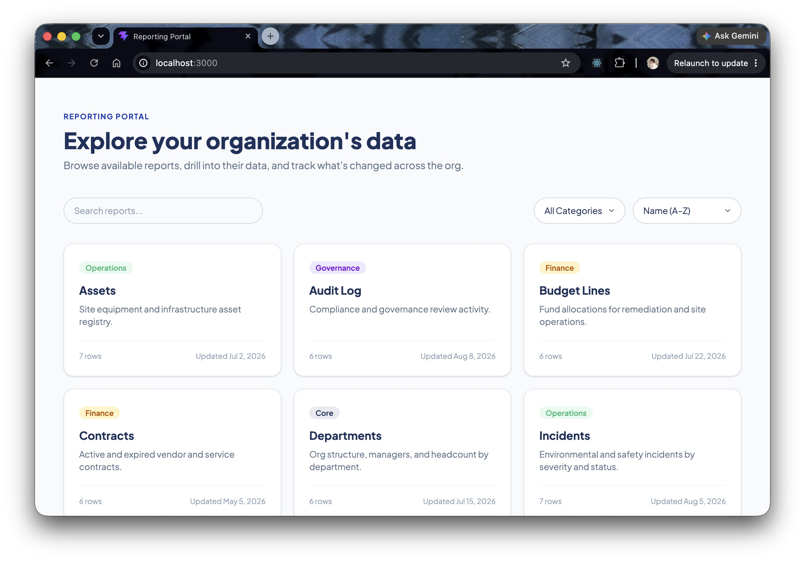
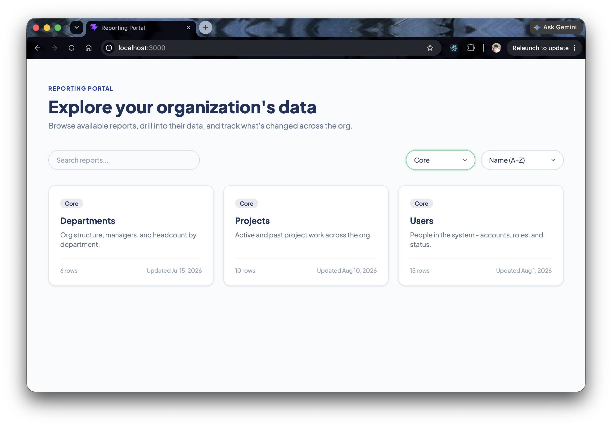
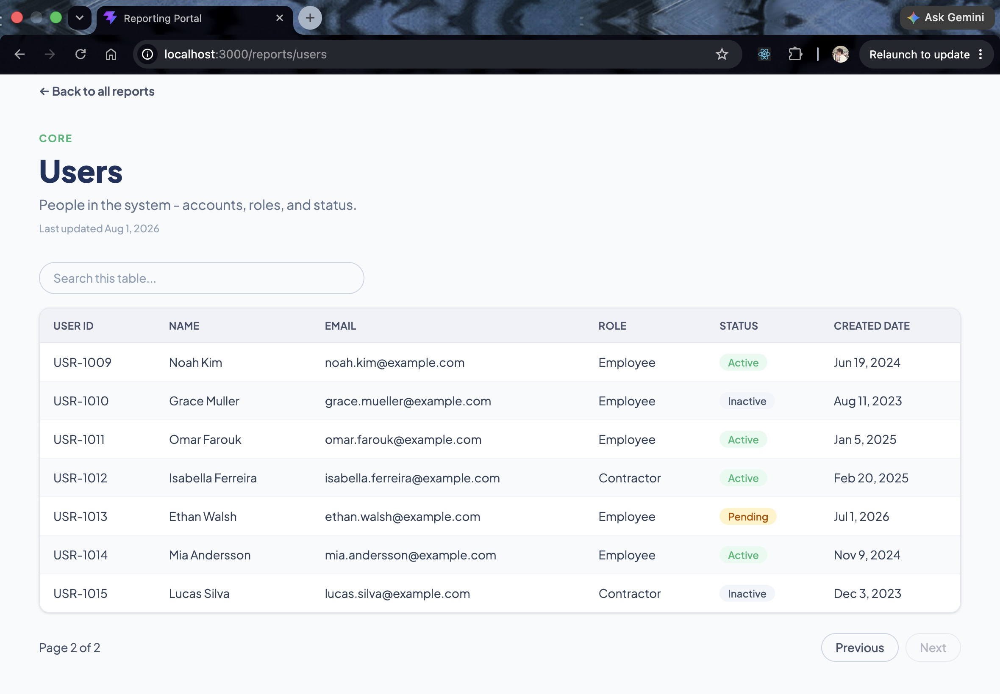
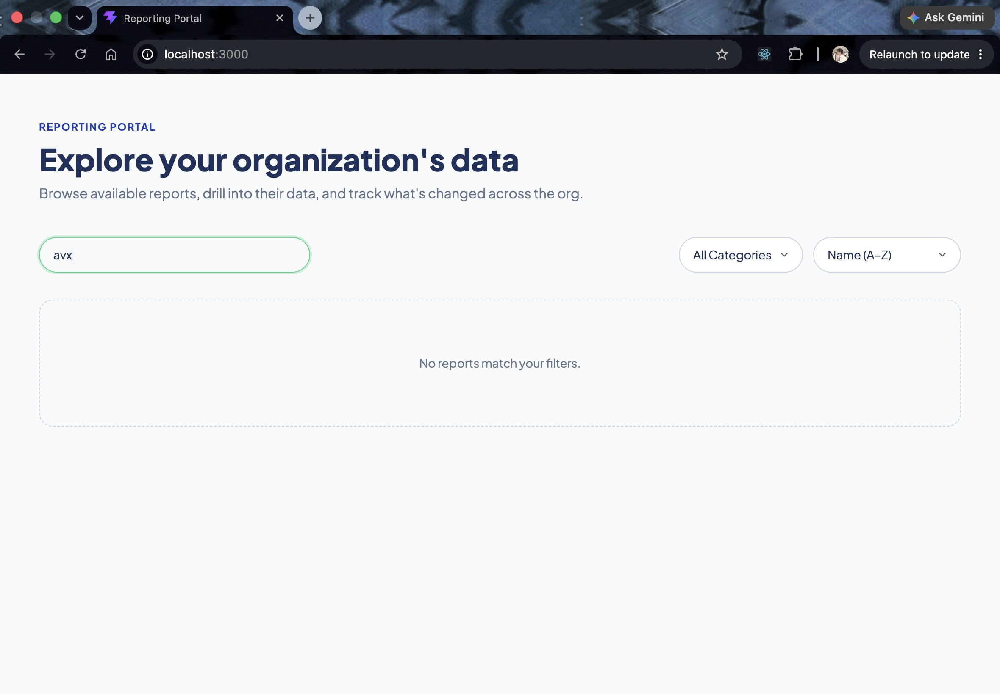
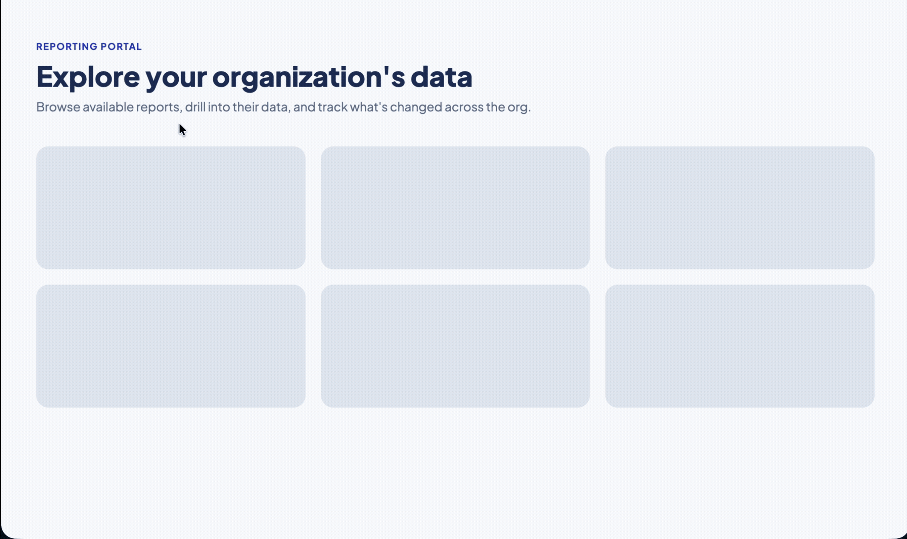
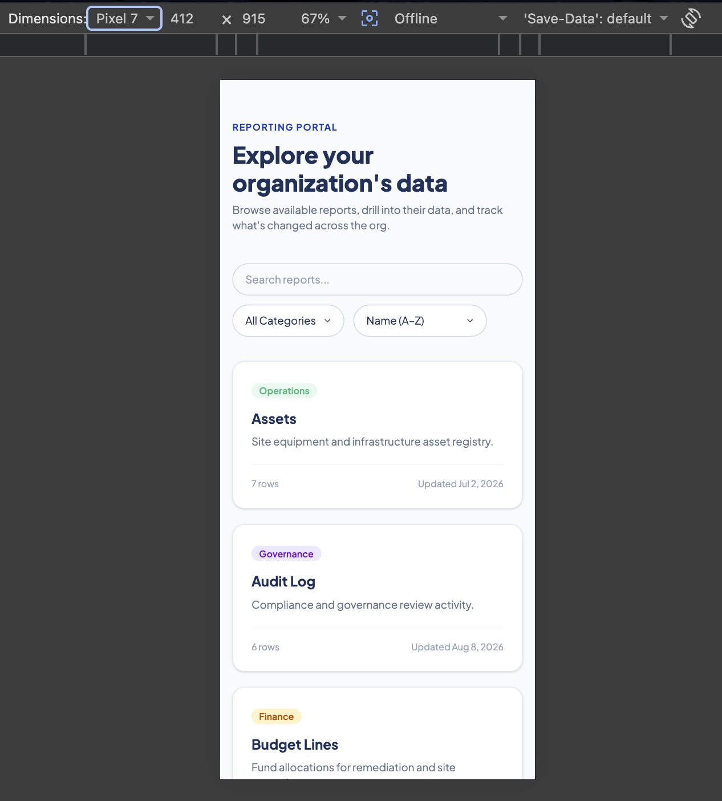

# Reporting Portal

A full-stack internal reporting portal — a React landing page where users browse available reports and open each one into a searchable, sortable, paginated table, backed by a Spring Boot REST API. Built for the Enfos engineering take-home assessment.

## Screenshots

| | |
|---|---|
| **Landing page** | **Filter & sort** |
|  |  |
| **Report table** | **Empty state** |
|  |  |
| **Error state + retry** | **Loading state** |
|  |  |
| **Mobile / responsive view** | |
|  | |

## Quick start (Docker Compose)

Requires [Docker](https://www.docker.com/) with the Compose plugin (Docker Desktop includes both).

```bash
docker compose up --build
```

Open **http://localhost:3000**. The backend (port 8080) starts first and must pass a healthcheck before the frontend container starts — `docker compose ps` will show `backend` as `(healthy)` once that happens.

Stop everything with:

```bash
docker compose down
```

## Standalone development (no Docker)

Useful for active development — hot reload on both sides.

**Backend** (needs Java 17+; the committed Maven Wrapper handles Maven itself):

```bash
cd backend
./mvnw spring-boot:run
```

Serves on `http://localhost:8080`.

**Frontend** (needs Node 18+):

```bash
cd frontend
npm install
npm run dev
```

Serves on `http://localhost:5173`, proxying `/api/*` to `localhost:8080` (see `vite.config.js`) — no CORS configuration needed for this path. `backend/.../config/CorsConfig.java` additionally allows direct cross-origin calls from `localhost:5173` for cases outside that proxy.

## API

All endpoints are under `/api/reports`.

| Method | Path | Returns |
|---|---|---|
| GET | `/api/reports` | Metadata for all 9 reports |
| GET | `/api/reports/meta/{id}` | Metadata for a single report |
| GET | `/api/reports/users` | Users report rows |
| GET | `/api/reports/departments` | Departments report rows |
| GET | `/api/reports/projects` | Projects report rows |
| GET | `/api/reports/{id}` | Row data for any other report (`vendors`, `incidents`, `assets`, `audit-log`, `budget-lines`, `contracts`) |

All data is in-memory mock data, seeded on startup — no database.

## Demonstrating loading / empty / error states

- **Loading**: visible naturally on any fetch (skeleton placeholders); on `docker compose up`, briefly visible on first load.
- **Empty**: search the landing page or a report table for something that matches nothing (e.g. `zzz`).
- **Error + retry**: since the backend starts healthy and stays up, a reviewer won't hit this by just using the app. To see it deliberately:
  ```bash
  docker compose stop backend
  ```
  Reload the frontend or click **Retry** — you'll see the error state. Then:
  ```bash
  docker compose start backend
  ```
  Click **Retry** again to see it recover, without a page reload.

## Assumptions & tradeoffs

- **In-memory mock data, no database.** The brief allows this explicitly. Data resets on every backend restart; nothing is persisted.
- **Client-side search/sort/pagination.** All of it happens in the browser against data already fetched in full. Fine at this data scale (under 20 rows per report); wouldn't scale to a report with tens of thousands of rows without moving to server-side paging/filtering.
- **No authentication.** Not required by the brief; the app is fully open. Every visitor sees the same data.
- **9 reports, not 3.** The brief requires exactly Users, Departments, and Projects, which are implemented exactly to spec. Six more reports (Vendors, Incidents, Assets, Audit Log, Budget Lines, Contracts) were added on top so the landing page's pagination is actually demonstrable — with only 3 reports there'd be nothing to paginate. They share one generic backend record shape (`id`, `name`, `category`, `status`, `updatedDate`) rather than six bespoke models, since they exist for UI demonstration rather than being part of the required data model.
- **Two endpoints beyond the brief's required four**: `GET /api/reports/meta/{id}` (single-report metadata, used by the report detail page header) and the generic `GET /api/reports/{id}` (row data for the six extra reports). Both were added deliberately, not required by the spec.
- **Frontend calls the backend via a relative `/api` path everywhere** (dev, Docker, or tunneled through something like ngrok), proxied server-side — by Vite's dev server locally, by nginx in the Docker image. The browser never makes a cross-origin request to the backend in either case, which is also why CORS isn't relevant to the Docker path at all.
